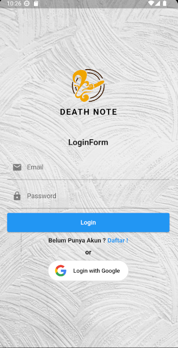
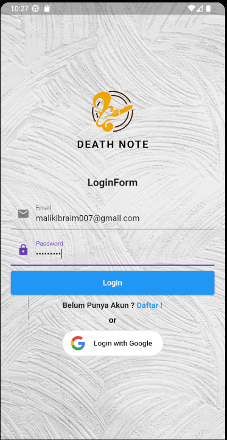
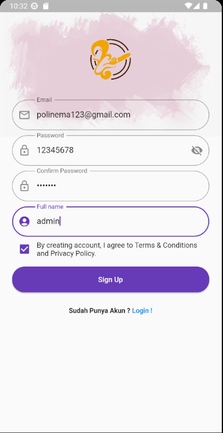
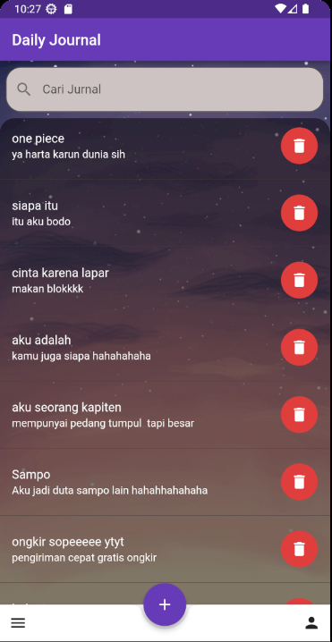
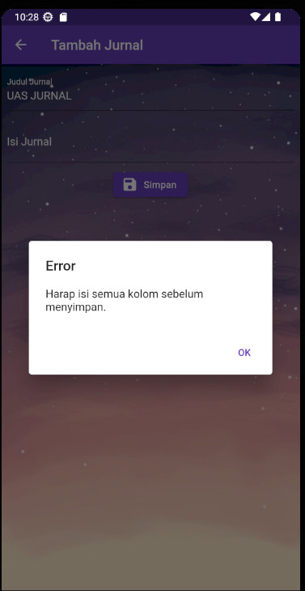
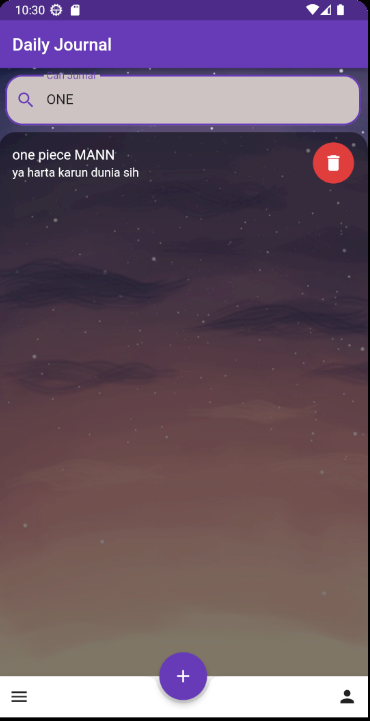

# JURNAL HARIAN

NAMA : JA'FAR MALIK IBRAHIM

NIM : 2131750007

PRODI : D3 MANAJEMEN INFORMATIKA

---

# DESKRIPSI

## Aplikasi jurnal harian adalah perangkat lunak yang dirancang untuk membantu pengguna mencatat dan menyimpan catatan harian mereka. Ini adalah alat digital yang memungkinkan pengguna untuk membuat entri harian, mencatat pengalaman, pemikiran, perasaan, atau peristiwa yang terjadi dalam hidup mereka.

---

# CARA KERJA APLIKASI

1. LOGIN E-MAIL DAN PASSWORD, JIKA BELUM MEMPUNYAI AKUN SILAHKAN DAFTAR TERLEBIH DAHULU, PASTIKAN MENGISI KOLOM EMAIL DAN PASSWORD BENAR. ANDA JUGA BISA LOGIN MENGGUNAKAN GOOGLE

2. REGISTER DENGAN MENGISI EMAIL, PASSWORD, DAN NAMA PENGGUNA CEKLIS PRIVACY POLICE NYA DAN KLIK TOMBOL SIGN UP. PADA HALAMAN REGISTER WALLPAPER MENGGUNAKAN HTTP REQUEST YG MANA LINK FOTO MENGAMBIL DARI WEBSITE.

3. HALAMAN PERTAMA, DISINI ADA FITUR ADD JIKA INGIN MENAMBAH ENTRI BARU, SETELAH DI KLIK PASTIKAN KOLOM JUDUL DAN ISI SUDAH TERISI APABILA DI BIARKAN KOSONG AKAN ADA POP UP WARNING, SETELAH TERISI SEMUA KLIK TOMBOL SIMPAN DAN ENTRI BARU TELAH DI TAMPILKAN DI HALAMAN PERTAMA.

4. EDIT , JIKA INGIN MENGUBAH CATATAN YG TELAH DI BUAT TADI ANDA TINGGAL KLIK DATA DI HALAMAN UTAMA, OTOMATIS AKAN BERALIH KE TAMPILAN EDIT, KOLOM TIDAK BOLEH KOSONG KARENA AKAN MUNCUL POP UP WARNING, SAAT ANDA KLIK TOMBOL SIMPAN AKAN MUNCUL ANIMASI LOADING.

5. JIKA DATA SUDAH BANYAK ANDA BISA SCROLL DATA KEBAWAH DAN JIKA ANDA BINGUNG INGIN MENCARI DATA TERTENTU. TENANG APLIKASI INI SUDAH TERSEDIA FITUR PENCARIAN, ANDA TINGGAL MENULIS KATA KUNCI YANG INGIN DI CARI.

6. TERAKHIR TAMPILAN PROFIL YANG MANA MENAMPILKAN DATA ANDA.

7. TOMBOL LOG OUT UNTUK KEMBALI KE HALAMAN LOG IN.

NB: UNTUK TAMPILAN PROFIL BELUM BISA MENAMPILKAN DATA UNTUK LOGIN EMAIL DAN PASSWORD HANYA BISA MENAMPILKAN LOGIN WITH GOOGLE

---

# SCREENSHOT

LOGIN

INPUT EMAIL DAN PASSWORD

HALAMAN REGISTER

HALAMAN PERTAMA

TAMBAH JURNAL

POP UP WARNING

EDIT JURNAL

ANIMASI LOADING

FITUR PENCARIAN

PROFIL DAN LOG OUT

